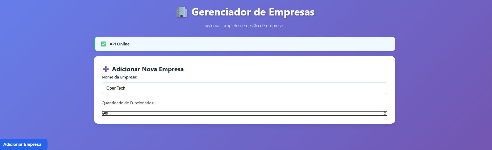
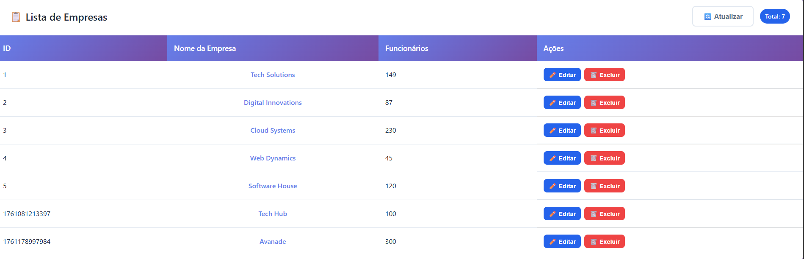

# 🚀 Instruções de Execução - Desafio Prático Aula 02

Este documento contém as instruções completas para executar cada parte do desafio prático.

---

## 📋 Pré-requisitos

Antes de começar, certifique-se de ter instalado:

- **Node.js** (versão 16 ou superior) - [Download aqui](https://nodejs.org/)
- **NPM** (vem com o Node.js)
- **Navegador web** (Chrome, Firefox, Edge, Safari)
- **Editor de código** (VS Code recomendado)

### Verificar instalações:

```bash
node --version
npm --version
```

---

## 🎯 Parte 1: Frontend Estático

### Como executar:

#### Opção 1: Abrir diretamente no navegador
```bash
# Navegar para a pasta da parte 1
cd solucao-exemplo/parte-1

# Abrir o arquivo index.html no navegador
# Duplo clique no arquivo ou
# Arraste o arquivo para o navegador
```

#### Opção 2: Usar servidor local (recomendado)
```bash
# Navegar para a pasta da parte 1
cd desafio-pratico/solucao-exemplo/parte-1

# Se você tem Node.js e npm:
npx http-server -p 8000

# Acessar no navegador:
# http://localhost:8000
```


### O que você deve ver:
- Uma página com título "Gerenciador de Empresas"
- Tabela estilizada com 5 empresas
- Design responsivo e visualmente atrativo

---

## 🛠️ Parte 2: Backend (API REST)

### Como executar:

```bash
# 1. Navegar para a pasta da parte 2
cd desafio-pratico/solucao-exemplo/parte-2

# 2. Instalar dependências
npm install

# 3. Iniciar o servidor
node server.js
# Ou se você configurou npm start:
npm start
```

### Verificar se está funcionando:

#### Teste 1: Endpoint de teste
```bash
# Abrir no navegador ou usar curl:
curl http://localhost:3000/api/test
```

**Resposta esperada:**
```json
{
  "message": "API funcionando!",
  "timestamp": "2024-XX-XXTXX:XX:XX.XXXZ"
}
```

#### Teste 2: Listar empresas
```bash
curl http://localhost:3000/api/empresas
```

#### Teste 3: Criar empresa
```bash
curl -X POST http://localhost:3000/api/empresas \
  -H "Content-Type: application/json" \
  -d '{"nome":"Teste Company","cnpj":"12.345.678/0001-90","cidade":"São Paulo","telefone":"(11) 1234-5678"}'
```

### Endpoints disponíveis:
- `GET /api/test` - Teste da API
- `GET /api/empresas` - Listar empresas
- `POST /api/empresas` - Criar empresa
- `PUT /api/empresas/:id` - Editar empresa
- `DELETE /api/empresas/:id` - Deletar empresa

### Troubleshooting:
- **Erro "porta em uso"**: Use `taskkill /f /im node.exe` (Windows) ou mude a porta
- **Erro "module not found"**: Execute `npm install` novamente
- **CORS error**: Verifique se o middleware CORS está configurado

---

## 🔗 Parte 3: Integração Frontend + Backend

### Como executar:

#### Passo 1: Iniciar o Backend
```bash
# Navegar para a pasta do backend da parte 3
cd desafio-pratico/solucao-exemplo/parte-3/backend

# Instalar dependências (se ainda não instalou)
npm install

# Iniciar o servidor
node server.js
```

#### Passo 2: Acessar o Frontend

##### Opção A: Servidor integrado (recomendado)
```bash
# O backend da parte 3 já serve os arquivos estáticos
# Abrir no navegador:
http://localhost:3000
```

**Esta é a opção recomendada pois evita problemas de CORS!**

##### Opção B: Servidor separado
```bash
# Em outro terminal, navegar para o frontend
cd desafio-pratico/solucao-exemplo/parte-3/frontend

# Usar qualquer servidor local
npx http-server -p 8080

# Acessar no navegador:
http://localhost:8080
```
PrintScreen



### Funcionalidades para testar:

1. **Status da API**: Indicador visual (online/offline)
2. **Listar empresas**: A tabela carrega automaticamente
3. **Criar empresa**: Use o formulário "Adicionar Nova Empresa"
4. **Editar empresa**: Clique no botão "Editar" em qualquer linha
5. **Deletar empresa**: Clique no botão "Excluir" e confirme no modal

### O que você deve ver:
- Interface moderna com gradiente azul
- Status da API (🟢 Online ou 🔴 Offline)
- Formulário responsivo para adicionar empresas
- Tabela dinâmica com as empresas
- Botões de ação (Editar/Excluir) funcionais
- Loading states durante operações
- Toast notifications de feedback
- Modal de confirmação para exclusão

PrintScreen


---

## � Como Encerrar a Aplicação

### ⚡ **Método Rápido (Recomendado):**

#### Se o servidor está rodando no terminal ativo:
```bash
# Pressionar Ctrl + C no terminal onde o servidor está executando
Ctrl + C
```

#### Para forçar o encerramento de todos os processos Node.js:
```bash
# Windows - Mata todos os processos Node.js
taskkill /f /im node.exe

# Verificar se ainda há processos rodando
tasklist | findstr node
```

### 📋 **Métodos Detalhados por Parte:**

#### Parte 1 (Frontend Estático):
```bash
# Se usando Live Server no VS Code:
# - Clique no botão "Port: 5500" na barra inferior do VS Code
# - Ou clique com botão direito no HTML > "Stop Live Server"

# Se usando npx http-server:
Ctrl + C  # No terminal onde está rodando

# Se aberto diretamente no navegador:
# - Apenas feche a aba do navegador (sem servidor para parar)
```

#### Parte 2 (Backend API):
```bash
# No terminal onde o servidor está rodando:
Ctrl + C

# Ou forçar encerramento:
taskkill /f /im node.exe

# Verificar se a porta 3000 está livre:
netstat -ano | findstr :3000
```

#### Parte 3 (Frontend + Backend Integrados):
```bash
# Método 1: Encerramento normal
Ctrl + C  # No terminal do servidor

# Método 2: Encerramento forçado (se Ctrl+C não funcionar)
taskkill /f /im node.exe

# Método 3: Encerrar processo específico da porta 3000
# 1. Encontrar o PID do processo:
netstat -ano | findstr :3000

# 2. Matar o processo específico (substitua XXXX pelo PID encontrado):
taskkill /f /pid XXXX
```

### 🚨 **Troubleshooting - Quando o Servidor Não Para:**

#### Problema: Ctrl+C não funciona
```bash
# Solução: Usar taskkill
taskkill /f /im node.exe
```

#### Problema: Erro "porta em uso" ao reiniciar
```bash
# 1. Verificar qual processo está usando a porta:
netstat -ano | findstr :3000

# 2. Matar o processo específico:
taskkill /f /pid [PID_NUMERO]

# 3. Ou matar todos os processos Node:
taskkill /f /im node.exe
```

#### Problema: Múltiplos servidores rodando
```bash
# Ver todos os processos Node ativos:
tasklist | findstr node

# Matar todos de uma vez:
taskkill /f /im node.exe

# Ou matar processo por processo:
taskkill /f /pid [PID1] /pid [PID2] /pid [PID3]
```

### ✅ **Verificar se a Aplicação Foi Encerrada:**

```bash
# Verificar se ainda há processos Node rodando:
tasklist | findstr node

# Verificar se a porta 3000 está livre:
netstat -ano | findstr :3000

# Testar se o servidor parou (deve dar erro de conexão):
Invoke-RestMethod -Uri "http://localhost:3000/api/test" -Method Get
```

**Resposta esperada após encerramento correto:**
```
Invoke-RestMethod : Impossível conectar-se ao servidor remoto
```

### 🔄 **Reiniciar Após Encerramento:**

```bash
# Navegar para o diretório da aplicação desejada:
cd "aula-02\desafio-pratico\solucao-exemplo\parte-2"
# ou
cd "aula-02\desafio-pratico\solucao-exemplo\parte-3\backend"

# Iniciar novamente:
node server.js
```

---

## �🔧 Comandos Úteis

### Para desenvolvimento:
```bash
# Verificar se a porta está em uso (Windows)
netstat -ano | findstr :3000

# Matar processos Node.js (Windows)
taskkill /f /im node.exe

# Verificar processos Node ativos
tasklist | findstr node

# Reinstalar dependências
rmdir /s node_modules
del package-lock.json
npm install
```

### Para testar APIs:
```bash
# Testar com curl (Windows PowerShell)
Invoke-RestMethod -Uri "http://localhost:3000/api/empresas" -Method Get

# Criar empresa via PowerShell
$body = @{
    nome = "Nova Empresa"
    cnpj = "12.345.678/0001-90"
    cidade = "São Paulo"
    telefone = "(11) 9999-9999"
} | ConvertTo-Json

Invoke-RestMethod -Uri "http://localhost:3000/api/empresas" -Method Post -Body $body -ContentType "application/json"
```

---

## 🐛 Solução de Problemas Comuns

### Backend não inicia:
- ✅ Verifique se o Node.js está instalado: `node --version`
- ✅ Verifique se as dependências estão instaladas: `npm install`
- ✅ Verifique se a porta 3000 está disponível
- ✅ Mate processos Node existentes: `taskkill /f /im node.exe`

### Frontend não conecta com Backend:
- ✅ Verifique se o backend está rodando na porta 3000
- ✅ Verifique se não há erros de CORS no console do navegador (F12)
- ✅ Confirme se a URL da API no frontend está correta
- ✅ Use o servidor integrado (parte 3) para evitar CORS

### Dados não persistem:
- ✅ Verifique se o arquivo `data/empresas.json` existe
- ✅ Verifique as permissões de escrita na pasta `data/`
- ✅ Veja os logs do servidor para erros de I/O
- ✅ Certifique-se de que o diretório `data/` foi criado

### Erro de CORS:
- ✅ Certifique-se de que o middleware CORS está configurado no backend
- ✅ Use o servidor integrado (parte 3) que serve frontend e backend juntos
- ✅ Se usar servidores separados, adicione a origem no CORS

### Interface não carrega corretamente:
- ✅ Abra o console do navegador (F12) para ver erros JavaScript
- ✅ Verifique se todos os arquivos CSS e JS estão carregando
- ✅ Confirme se a API está respondendo corretamente
- ✅ Teste em modo incógnito para evitar cache

---

## 📱 Testando Responsividade

1. **Desktop**: Teste em tela cheia
2. **Tablet**: Redimensione o navegador para ~768px
3. **Mobile**: Redimensione para ~375px
4. **Ferramentas do navegador**: 
   - Pressione F12
   - Clique no ícone de dispositivo móvel
   - Teste diferentes resoluções

---

## 📊 Estrutura Final dos Arquivos

```
desafio-pratico/
├── README.md                  # Descrição do desafio
├── README-EXECUCAO.md         # Este arquivo
└── solucao-exemplo/
    ├── parte-1/
    │   ├── index.html         # Página estática
    │   └── style.css          # Estilos da página
    │   └── solucao-parte-1/
    │       └── index-p1.html  # Versão alternativa
    ├── parte-2/
    │   ├── package.json       # Dependências
    │   ├── server.js          # Servidor Express
    │   ├── routes/
    │   │   └── empresas.js    # Rotas da API
    │   └── data/
    │       └── empresas.json  # Dados persistidos
    └── parte-3/
        ├── backend/
        │   ├── package.json   # Dependências do backend
        │   ├── server.js      # Servidor que serve API + frontend
        │   ├── routes/
        │   │   └── empresas.js # Rotas da API
        │   └── data/
        │       └── empresas.json # Dados persistidos
        └── frontend/
            ├── index.html     # Interface completa
            ├── style.css      # Estilos modernos
            └── script.js      # JavaScript com CRUD
```


---

## ⚡ Comandos Rápidos de Encerramento

### 🛑 **Para Parar o Servidor:**

```bash
# Método Normal (no terminal ativo):
Ctrl + C

# Método Forçado (qualquer terminal):
taskkill /f /im node.exe

# Verificar se parou:
tasklist | findstr node
netstat -ano | findstr :3000
```

### 🔄 **Para Reiniciar:**

```bash
# Parte 2:
cd "aula-02\desafio-pratico\solucao-exemplo\parte-2"
node server.js

# Parte 3:
cd "aula-02\desafio-pratico\solucao-exemplo\parte-3\backend"
node server.js
```

---

**Lembre-se**: O objetivo é ter um sistema fullstack completo funcionando! 🎯

**🛑 IMPORTANTE**: Sempre encerre o servidor corretamente antes de fechar o terminal ou reiniciar!