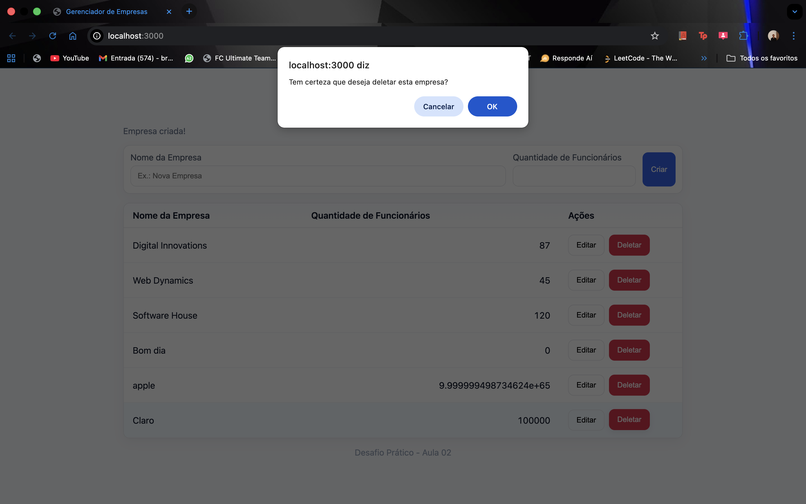
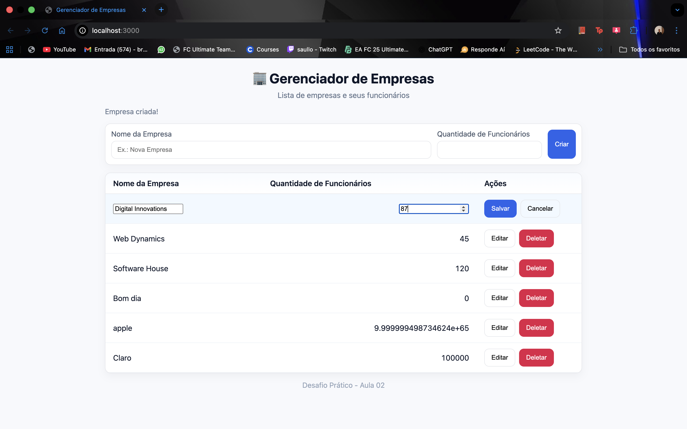

Gerenciador de Empresas – Parte 3

Integração Frontend + Backend (CRUD Completo) 

Estrutura do Projeto
parte-3/
├── README.md
├── package.json
├── backend/
│   ├── server.js
│   ├── routes/
│   │   └── empresas.js
│   └── data/
│       └── empresas.json
└── frontend/
    ├── index.html
    ├── style.css
    └── script.js

Instalação e Execução
1️ - Pré-requisitos:

    * Node.js instalado (versão 16 ou superior)

    * Navegador moderno (Chrome, Edge, Firefox)

2️ - Instalar dependências:

    * Abra o terminal na pasta parte-3 e execute:

        npm install

    * Isso instala as bibliotecas Express e Cors usadas pelo backend.

3️ - Iniciar o servidor: 
    * npm start
    
    * Se tudo estiver certo, aparecerá no terminal: Servidor rodando em http://localhost:3000

4️ - Acessar no navegador:

    * Abra no navegador o endereço:
        http://localhost:3000
    
    * A página será carregada com a lista de empresas e os botões de ações.

5 - Funcionalidade:

    * Listar empresas
    * Criar empresas
    * Editar empresa
    * Deletar empresa

6 - Prints:

